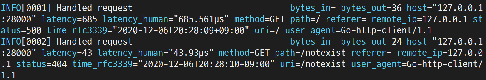
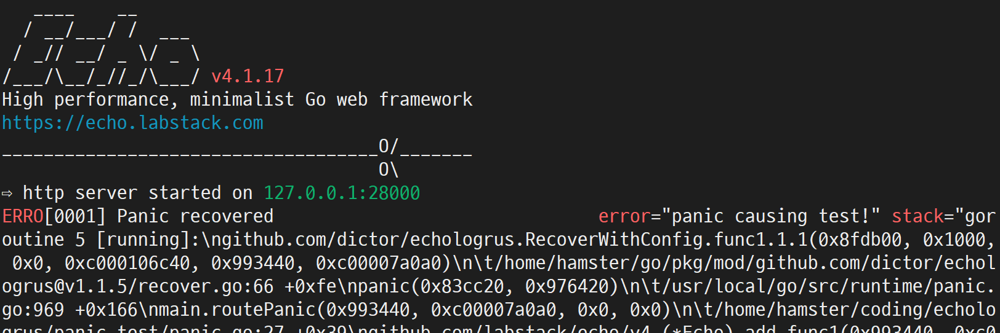

## echologrus
[](https://pkg.go.dev/github.com/dictor/echologrus)
[](LICENSE)

Middleware echologrus is a [logrus](https://github.com/sirupsen/logrus) logger support for [echo](https://github.com/labstack/echo).
Only support echo **v4**. Provide http request and panic (served from route handler) logging feature to your echo server with logrus logger.

http requset logging example

served panic logging example


### Install

```sh
go get -u github.com/dictor/echologrus
```

### Usage
#### Basic
```go
import (
	elogrus "github.com/dictor/echologrus"
	"github.com/labstack/echo/v4"
	"net/http"
)

func main() {
	e := echo.New()
	elogrus.Attach(e)
	e.GET("/", func(c echo.Context) error {
		return c.String(http.StatusOK, "Hello, World!")
	})
	e.Logger.Fatal(e.Start(":80"))
}
```

#### Using custom formatter
```go
	e := echo.New()
	elogrus.Attach(e).Logger.Formatter = new(prefixed.TextFormatter)
```


